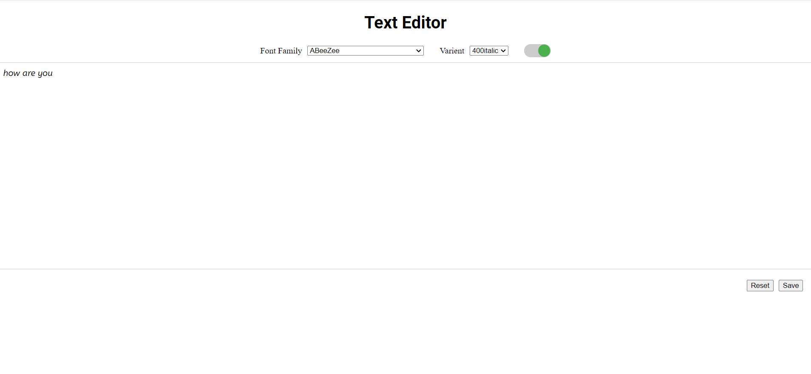

# Text Editor

This project implements a simple text editor with a font family, font weight, and italic selector. The font selector shows a list of all Google fonts, and the font weight selector shows the appropriate font weights supported for the selected font family. The italic toggle is only active if the selected font family and weight combination supports italic. The editor also includes auto-save functionality that saves the text and font family locally in the browser. On reloading the page, existing content is loaded, and the correct font family and variant are selected in the dropdown.

## Important Links

- [Deployed Link](https://frontend-pant-partners.vercel.app/)

- [Repo Link](https://github.com/artisonii/frontend_pant_partners)

## Features

- Font family selector with all Google fonts
- Font weight selector showing appropriate weights for the selected font family
- Italic toggle active only if the selected font family and weight combination supports italic
- Auto-save functionality saving text and font family locally in the browser
- Restores text and font family on page reload
- Handles cases where the selected font family doesn't support the selected variant
- Reset button functionality is also added

## Assumptions

- The JSON file provides a complete mapping between font names, their variants, and corresponding font URLs. we can also fetch the data for Rest API if it is available
- The local storage is used for storing the data.

## Improvements

Given more time, the following improvements could be made:

- Improve the design to make the editor more user-friendly and visually appealing.
- Add more error handling to cover edge cases and provide better feedback to the user.
- Optimize the loading of Google fonts to improve performance.
- Add support for additional font styles like bold, underline, etc.
- Implement a more sophisticated algorithm for selecting the closest font weight and style when switching fonts.

## Setup and Running the Application

### Prerequisites

- Node.js and npm installed on your machine.

### Installation and running the repo

```bash
git clone https://github.com/artisonii/frontend_pant_partners.git

cd frontend_pant_partners

npm install

npm run dev

```

## Screenshots



# Created by Arti Soni

- [LinkedIn](https://www.linkedin.com/in/arti-soni/)
- [Portfolio](https://artisonii.github.io/)
- [GitHub](https://github.com/artisonii)
